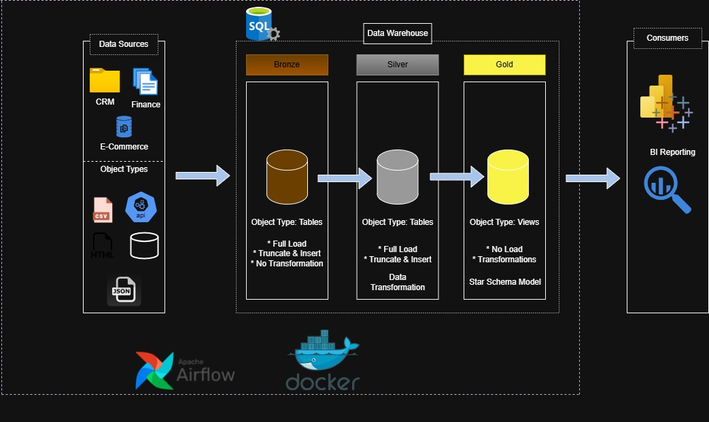
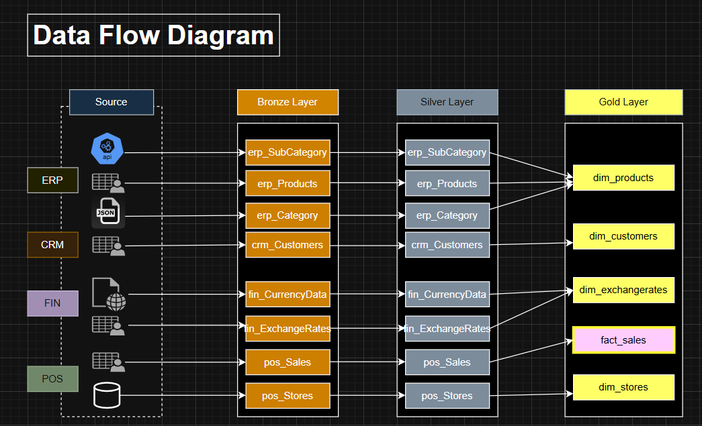
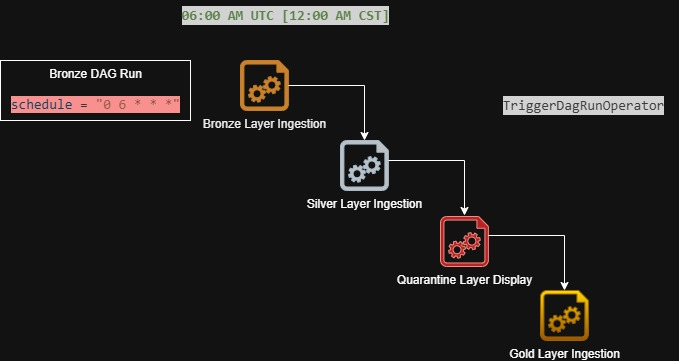
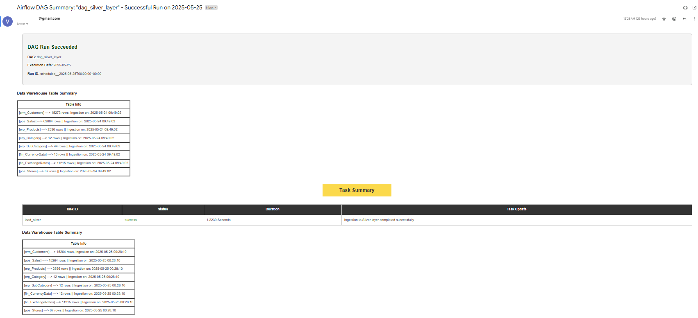
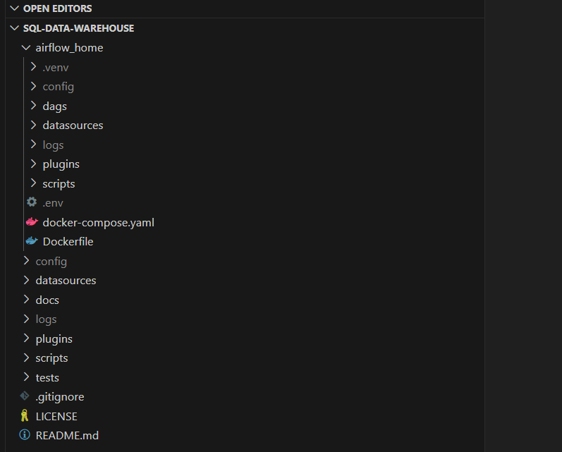
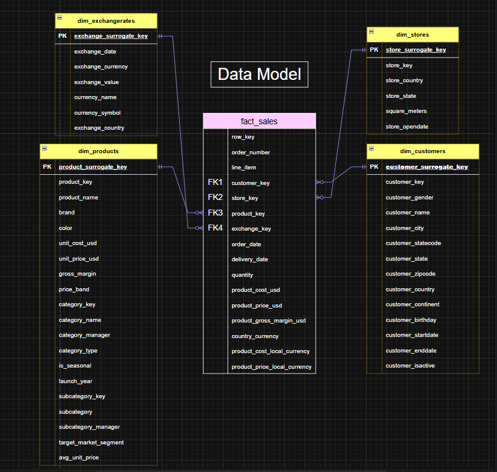

# SQL Data Warehouse and ETL Orchestration

Welcome to the end-to-end **Data Warehouse and ETL orchestration project** repository!

This is designed to simulate a real-world retail data flow. This repository demonstrates a scalable and modular architecture using Python, SQL Server, and Apache Airflow with docker implementation. In details, it is focused on demonstrating the working with various file formats (CSV, JSON, API, DB) from different systems and building a data warehouse using ETL pipelines and using orchestration tool to schedule the automated runs, following the Medallion architecture to facilitate the effective Business Intelligence reporting.

---
## 🏗️ Data Architecture

The data architecture for this project follows Medallion Architecture **Bronze**, **Silver**, and **Gold** layers:  



1. **Bronze Layer**: Stores raw data as-is from the source systems. Data is ingested from a Web API, HTML web page using data scraping, CSV Files, database table, and Json file into SQL Server Database.
2. **Silver Layer**: This layer includes data cleansing, standardization, and normalization processes to prepare data for analysis.
3. **Gold Layer**: Houses business-ready data modeled into a star schema required for reporting and analytics.

---
## 📖 Project Overview

**Objective:** Build a robust Data Warehouse for a multinational electronics retailer, covering the journey from raw data ingestion to enriched dimensional reporting using:

- ETL pipelines written in Python
- SQL Server as the data warehouse
- Apache Airflow 3.0 (Docker-based) for orchestration
- Support for CSV, JSON, and Web-Scraped Data, WEB API

The project simulates real-world enterprise patterns using Slowly Changing Dimensions (SCD), incremental loads, bulk inserts, data cleansing, and pipeline monitoring.

- Technologies Used:

    - SQL Server 2019 (Database + Stored Procedures)
    - Python (Pandas, pyodbc, requests, bs4)
    - Apache Airflow 3.0 (DAG-based orchestration)
    - Docker desktop for Windows
    - Power BI (optional: data visualization)        

- Data Flow:



This project involves:

1. **Data Architecture**: Designing a Modern Data Warehouse Using Medallion Architecture **Bronze**, **Silver**, and **Gold** layers.
2. **ETL Pipelines**: Extracting, transforming, and loading data from source systems into the warehouse.
3. **ETL Orchestration**: Schedule tasks involved in ETL process to run at specified intervals and avoid manual intervention to run the tasks.
4. **Business Visibility**: Receive updates on completion of the ETL runs and receive the timely information regarding task summary. Receiving updates on action for stakeholder on quarantined data. 
5. **Data Modeling**: Developing fact and dimension tables optimized for analytical queries.
6. **Analytics & Reporting**: Creating SQL-based reports and dashboards for actionable insights.

🎯 This repository serves as a resource to showcase expertise in:
- SQL Development
- Data Architect
- Data Engineering
- Workflow Management
- Docker Implementation  
- ETL Pipeline Development  
- Data Modeling  
- Data Analytics

---

## ⚙️ Orchestration with Apache Airflow

Schedule and manage ETL scripts in the correct order.


- Operators
    - PythonOperator: To execute the task with python implementation
    - ShortCircuitOperator: To evaluate the result from Python Operator [Conditionals]
    - SQLExecuteQueryOperator: To execute the queries in a task 
    - EmailOperator: Uses SMTP protocol to trigger an email in a task with specified output

- Dependencies
    - AIRFLOW_IMAGE_NAME=apache/airflow:3.0.0
    - _PIP_ADDITIONAL_REQUIREMENTS=apache-airflow-providers-smtp apache-airflow-providers-microsoft-mssql apache-airflow-providers-common-sql

- Requirements
    - ``.env`` file for using variable and values # Airflow Core Settings
    - ``docker-compose.yaml`` file to specify the environment, services, **volumes** [To match the local environment file path with the docker setup]
    - ``JWT & WEBSERVER`` secret keys
    - ``AIRFLOW_CONN_MSSQL_DEFAULT`` connection string for SQL Server
    - ``WEB UI`` connection set up - SQL Server user connection, SMTP email connection

**Example Task:** TriggerDagRunOperator




**Example Task:** EmailOperator




---

## 🛠️ Installation & Setup:

Please find below resources:

- **[Reference - Maven Analytics Datasource](https://mavenanalytics.io/data-playground?dataStructure=Multiple%20tables&order=date_added%2Cdesc&search=Global%20Electronics%20Retailer&tags=Retail):** Golbal Electronics Retailer
- **[Datasets](datasets/):** Access to the project dataset (Json, Web API, HTML Web Page, database table, csv files).
- **[SQL Server Express](https://www.microsoft.com/en-us/sql-server/sql-server-downloads):** Lightweight server for hosting your SQL database.
- **[SQL Server Management Studio (SSMS)](https://learn.microsoft.com/en-us/sql/ssms/download-sql-server-management-studio-ssms?view=sql-server-ver16):** GUI for managing and interacting with databases.
- **[Git Repository](https://github.com/):** Set up a GitHub account and repository to manage, version, and collaborate on your code efficiently.
- **[DrawIO](https://www.drawio.com/):** Design data architecture, models, flows, and diagrams.
- **[Airflow](https://airflow.apache.org/):** Perform workflow management using Airflow to schedule the tasks and run them as per the timelines.
- **[Docker](https://docs.docker.com/desktop/setup/install/windows-install/):** Docker implementation helps in maintaining the dependencies required for airflow in separate containers.

### Setup

- Virtual Environment setup for airflow in VS Code with `Python 3.8 - 3.10` for airflow implementation
- Install `apache-airflow==3.0.0` with official constraints
- `Python dependencies` installation within the virtual environment
- `Folder setup, Config & environmental variables` setup for airflow
- `volumes` setup in yaml to mount project for DAG and script access
- Start airflow with docker compose
- `Run WEB UI` - http://localhost:8080


**Folder Structure:**



   
> [!NOTE]  
> Specific folders and files (.env .config utils logs) have been added to .gitignore as they contain authentication tokens.

---

## 🚀 Project Requirements

### Building the Data Warehouse (Data Engineering)

#### Objective
Develop a modern data warehouse using Airflow, and SQL Server to consolidate sales data, enabling analytical reporting and informed decision-making.

#### Specifications
- **Data Sources**: Import data from two source systems (CRM, ERP, FIN, POS) provided as (Json, Web API, HTML Web Page, database table, csv files).
- **Data Quality**: Cleanse and resolve data quality issues prior to analysis.
- **Integration**: Combine all sources into a single, user-friendly data model designed for analytical queries.
- **Scope**: Focused on current dataset, with an implementation of Slowly Changing Dimension - Type 2 on Customers
- **Orchestration**: Workflow management to schedule the task runs which involves various task operators with varied functionality.
- **Documentation**: Provide clear documentation of the data model to support both business stakeholders and analytics teams.

---

## 📈 Data Catalog

Please find [docs/DataCatalogue_Gold.md](docs/DataCatalogue_Gold.md) for full table documentation of:

- gold.fact_sales
- gold.dim_customers
- gold.dim_products
- gold.dim_stores
- gold.dim_exchangerates

---

## 📌 Summary

✅ Realistic multi-layer ETL orchestration

✅ Simulates production DWH practices (SCD2, error logging, incremental loads)

✅ Fully modular Python + SQL Server design

✅ Airflow 3.0 orchestration with Docker


---

### BI: Analytics & Reporting (Data Analysis)

#### Model: 
`Star Schema`



#### Objective
Develop SQL-based analytics to deliver detailed insights into:
- **Customer Behavior**
- **Product Performance**
- **Sales Trends**
- **Net Returns**

These insights empower stakeholders with key business metrics, enabling strategic decision-making.  

For more details, refer to [docs/requirements.txt](docs/requirements.txt).

---

## 📂 Repository Structure
```
data-warehouse-project/
├── .git
│
├── airflow_home/           # Airflow metadata, logs, and dags
├   ├── dags/                   # 3 dags for each layer and an example
├   ├── Dockerfile/             # To install docker dependencies required for certain tasks
├   ├── docker-compose.yaml/    # Airflow Docker configuration for local development 
│    
├── DataSources/            # Raw data files (CSV, JSON, Web API, HTML webpage Scraping, database table)
│
├── docs/                   # Diagrams and documentation
│   ├── Data Flow Diagram/
│   ├── Data Integration Diagram/ 
│   ├── Data Model Diagram/
│   ├── Lernings/
│   ├── Data Catalogue - Gold Layer/
│   ├── fastapi-subcategory-api/              # Manual API Creation: # Creation of Render API [Json to WEB API]
│   ├── GithubPage_Currency/                  # Manual Github.io Webpage: # html table web scraping simulation
│
├── scripts/
│   ├── etl_python/
│   │   ├── bronze/         # Bronze layer ETL scripts - Raw data
│   │   ├── silver/         # Silver layer transformations
│   │   ├── gold/           # Gold layer views/aggregations
│   │   └── utils/          # Shared DB connections, logging
│   └── sql_scripts/        # Stored procedures by layer
│       ├── sql_bronze/
│       ├── sql_silver/
│       ├── sql_gold/
│       ├── sql_quarantine/         # Quarantine data which has failed certain criteria - To be evaluated by stakeholders
│
├── tests/                              # Test scripts and quality files
│
├── README.md                           # Project overview and instructions
├── LICENSE                             # License information for the repository
├── .gitignore                          # Files and directories to be ignored by Git
└── requirements.txt                    # Dependencies and requirements for the project
```
---

## ☕ Stay Connected

Let's stay in touch! Feel free to connect with me on the following platforms:

[](https://www.linkedin.com/in/venkateswara-reddy-dundi/)

---

## 🛡️ License

This project is licensed under the [MIT License](LICENSE). You are free to use, modify, and share this project with proper attribution.

---

## 🙏 Acknowledgment

Thanks for exploring this project. If this helped you, feel free to ⭐ the repo and share your feedback!

---


## 🌟 About Me

Hi there! I'm **Venkateswarareddy Dundi** — a data engineering enthusiast dedicated to building scalable data pipelines and implementing robust data warehousing practices. I’m passionate about transforming raw data into trusted, actionable insights that drive business value. I enjoy designing efficient ETL workflows, automating processes, and delivering high-impact solutions that bridge data and decision-making.